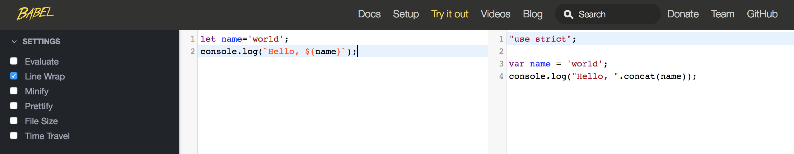
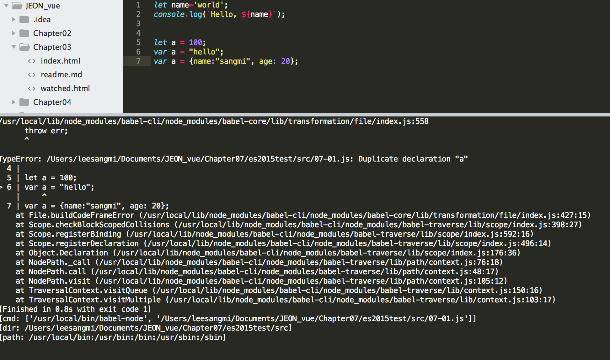

# 07. ECMAScript 2015
* Vue.js 기반의 SPA(Single Page Application) 애플리케이션을 개발하려면 Vue Router, Vuex등의 다양한 요소가 필요합니다.
* 이들을 이용하기 위해서는 ECMAScript 2015(이하 ES2015라고 표기합니다.)나, Typescript등을 사용해야 합니다.
* 최신 브라우저에서만 지원하므로 트랜스파일러(Transpiler)라는 것을 이용해 하위 버전의 자바스크립트로 번역합니다.
* 대표적인 트랜스파일러는 Babel, TSC(typeScript Compiler)이며, Vue CLI는 두 가지 트랜스파일러를 모두 제공합니다.
* 이 책에서는 ES2015 코드를 작성하고 Babel로 트랜스파일하여 실행해 볼 것입니다.

## 7.1 ES2015를 사용하기 위한 프로젝트 설정
1. 프로젝트 디렉터리 생성 : 임의의 폴더(es2015test) 생성
2. package.json파일 생성 : 프로젝트 디렉터리로 이동 후 npm init (기본값으로 설정)
    
3. Babel 관련 라이브러리는 자주 사용되기 때문에 전역에 설치 ([yarn](https://www.holaxprogramming.com/2017/12/21/node-yarn-tutorials/) 설치 권장)
    + npm install -g babel-cli yarn (windows)
    + sudo npm install -g babel-cli yarn (macOS)
4. Babel 트랜스파일러는 개발 의존성 패키지로 설치합니다.
    + yarn add -D babel-cli babel=preset-env babel-preset-stage-2
    + npm install --save-dev babel-cli babel=preset-env babel-preset-stage-2
    
5. .babelrc 파일 작성(Babel 사용시 필수)
```
    {
        "presets":["env","stage-2"]
    }
```
6. [예제 07-01](es2015test/src/07-01.js)를 통해 트랜스파일된 코드 확인
	+ VSCode : build 디렉터리에 동일한 파일명으로 출력 (node build/07-01.js 실행)
	+ babel 명령어로 코드를 변환 : babel src -d build -w
	+ Babel 사이트에서 직접 변환 : <https://babeljs.io/repl/>에 접속해서 코드를 직접 확인 할 수도 있습니다.
	

## 7.2 let과 const : [Jeonjeongho/JEON206 참고](https://github.com/Jeonjeongho/JEON206/blob/master/Chapter3/index.md#%EB%B3%80%EC%88%98%EC%99%80-%EC%83%81%EC%88%98)
* let과 const는 변수선언 키워드 입니다.
* ES2015 이전까지는 var 키워드를 사용하였는데 호이스팅이 되고, 중복 선언해도 오류가 발생하지 않았습니다.
* 이러한 문제를 해결하기 위해 let드 키워를 지원합니다. (블록 단위의 스코프, 중복 선언 방지)
* const는 상수 기능을 제공합니다. 즉 한번 값이 주어지면 다시 변경할 수 없습니다.
    + var 키워는 중복 선언해도 오류가 발생하지 않습니다.
    ```
    var a = 100;
    var a = "hello";
    var a = {name:"sangmi", age: 20};
    ```
    + let을 사용하면 오류 발생
    ```
    let a = 100;
    var a = "hello";
    var a = {name:"sangmi", age: 20};
    ```
    


## 7.3 기본 파라미터와 가변 파라미터
## 7.4 구조분해 할당(destructuring  assignment)
## 7.5 화살표 함수(Arrow function)
## 7.6 새로운 객체 리터럴
## 7.7 템플릿 리터럴
## 7.8 컬렉션
## 7.9 클래스
## 7.10 모듈
## 7.11 Promise
## 7.12 전개 연산자(Spread Operator)