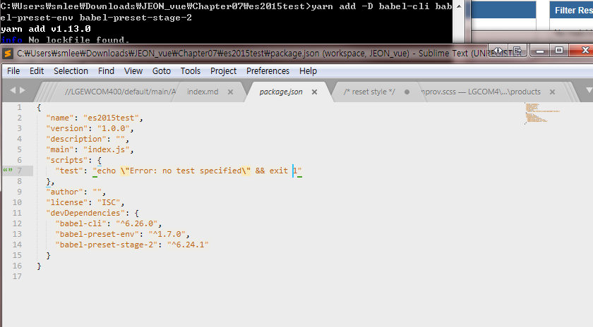

# 07. ECMAScript 2015
대규모 앱을 개발하려면 SPA(Single Page Application) 구조라야 하는데, Vue.js 기반의 SPA 애플리케이션을 개발하려면 Vue Router, Vuex등의 다양한 요소가 필요합니다.
이들을 이용하기 위해서는 ECMAScript 2015(이하 ES2015라고 표기합니다.)나, Typescript등을 사용해야 합니다. 하지만 ES2015는 최신브라우저에서만 지원하고 Typescript는 브라우저에서 직접 실행 되지 않아 트랜스파일러(Transpiler)를 이용해 하위 버전에서 사용할 수 있는 자바스크립트로 번역해서 사용합니다.
이 책에서는 ES2015 코드를 작성하고 Babel로 트랜스파일하여 실행해 볼 것입니다.

## 7.1 ES2015를 사용하기 위한 프로젝트 설정
1 프로젝트 디렉터리 생성 : 임의의 폴더(es2015test) 생성
2 package.json파일 생성 : 프로젝트 디렉터리로 이동 후 npm init (기본값으로 설정)
    
3 Babel 관련 라이브러리는 자주 사용되기 때문에 전역에 설치 ([yarn](https://www.holaxprogramming.com/2017/12/21/node-yarn-tutorials/) 설치 권장)
    + npm install -g babel-cli yarn (windows)
    + sudo npm install -g babel-cli yarn (macOS)
4. Babel 트랜스파일러는 개발 의존성 패키지로 설치합니다.
    + yarn add -D babel-cli babel=preset-env babel-preset-stage-2
    + npm install --save-dev babel-cli babel=preset-env babel-preset-stage-2
    
5. .babelrc 파일 작성(Babel 사용시 필수)
```
    {
        "presets":["env","stage-2"]
    }
```

