# Chapter 11 : Vuex를 이용한 상태 관리
## 11.1 왜 Vuex를 사용하는가?
Vuex는 Vue.js 애플리케이션에 대한 상태 관리 패턴 + 라이브러리 이다. 애플리케이션의 모든 컴포넌트에 대한 중앙 집중식 저장소 역할을 하며 예측 가능한 방식으로 상태를 변경할 수 있다. 또한 Vue의 공식 devtools 확장 프로그램과 통합되어 설정 시간이 필요 없는 디버깅 및 상태 스냅 샷 내보내기/가져오기와 같은 고급 기능을 제공한다.
### "상태 관리 패턴"이란 무엇인가?
간단한 Vue 가운터 앱부터 시작 해보자.
```
new Vue({
  // 상태
  data () {
    return {
      count: 0
    }
  },
  // 뷰
  template: `
    <div>{{ count }}</div>
  `,
  // 액션
  methods: {
    increment () {
      this.count++
    }
  }
})
```
다음과 같은 기능을 가진 앱이다.
* **상태**는 앱을 작동하는 원본 소스 이다.
* **뷰**는 상태의 선언적 매핑 이다.
* **액션**은 **뷰** 에서 사용자 입력에 대해 반응적으로 상태를 바꾸는 방법이다.


그러나 **공통의 상태를 공유하는 여러 컴포넌트** 가 있는 경우 단순함이 빠르게 저하 된다.

* 여러 뷰는 같은 상태에 의존한다.
* 서로 다른 뷰의 작업은 동일한 상태를 반영해야 할 수 있다.

첫번째 문제의 경우, 지나치게 중첩된 컴포넌트를 통과하는 prop는 장황할 수 있으며 형제 컴포넌트에서는 작동하지 않는다. 

두번째 문제의 경우 직접 부모/자식 인스턴스를 참조하거나 이벤트를 통해 상태의 여러 복사본을 변경 및 동기화 하려는 등의 해결 방법을 사용해야 한다. 이러한 패턴은 모두 부서지기 쉽고 유지보수가 불가능한 코드로 빠르게 변경된다.

이러한 이유로 Vuex와 같은 상태 관리 라이브러리를 사용한다. 정리 하자면 다음과 같다.
* 중앙 집중화된 상태 정보 관리가 필요하다.
* 상태 정보가 변경되는 상황과 시간을 추적하고 싶다.
* 컴포넌트에서 상태 정보를 안전하게 접근하고 싶다.

그렇다고 모든 애플리케이션 개발 시에 Vuex와 같은 상태 관리 라이브러리를 사용해야만 하는 것은 아니다. **간단한 구조의 애플리케이션 이라면 EventBus 객체의 사용 정도로도 충분히 해결될 수 있다.**

## 11.2 Vuex란?
Vue.js 의 상태관리 를 위한 패턴이자 라이브러리
### 상태관리(State Management)가 왜 필요한가?
컴포넌트 기반 프레임워크에서는 화면 구성을 위해 화면 단위를 매우 잘게 쪼개서 컴포넌트로 사용한다. 예를 들면, header, button, list 등의 작은 단위들이 컴포넌트가 되어 한 화면에서 많은 컴포넌트를 사용하게 된다. 이에 따라 컴포넌트 간의 통신이나 데이터 전달을 좀 더 유기적으로 관리할 필요성이 생긴다.

달리 말해, header -> button, button -> list , button -> footer 등의 컴포넌트 간 데이터 전달 및 이벤트 통신 등의 여러 컴포넌트의 관계를 한 곳에서 관리하기 쉽게 구조화 하는 것이 상태관리(State Management)이다.

## 11.3 상태와 변이
상태(state)와 변이(mutation)는 VueX 저장소(store) 내부의 핵심 요소이다. 상태는 애플리케이션에서 관리해야 할 중요한 데이터이며, 변이는 상태를 변경하는 함수들을 보유하고 있는 객체 이다. 전역에서 Vue.use(Vuex) 코드의 실행으로 애플리케이션 내부의 모든 컴포넌트가 저장소의 상태, 변이 객체에 접근할 수 있다. 상태는 반든시 변이를 통해서만 변경하도록 해야 한다.

### 11.3.1 간단한 Vue App 구성
Vuex 적용을 위해 Parent 컴포넌트와 Child 컴포넌트를 갖는 간단한 앱을 아래처럼 만들었다.

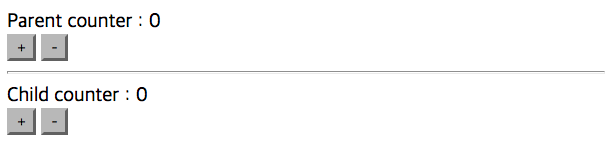

컴포넌트 폴더구조는 아래와 같다.

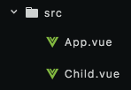

* App.vue : **Parent 컴포넌트** 또는 **상위 컴포넌트**
* Child.vue : **Child 컴포넌트** 또는 **하위 컴포넌트**

이 앱의 특징은 아래와 같다.

* 위 앱은 + 버튼 클릭 시 숫자가 올라가고, - 버튼 클릭 시 숫자가 감소된다.
* Parent 컴포넌트 - Child 컴포넌트 간 데이터 전달을 위해 [props](https://goo.gl/gYTXJB) 를 사용한다.
* 따라서, Parent counter 와 Child counter 는 같은 데이터 값 (counter) 을 공유하고 있다.

Parent 컴포넌트 (App.vue) 의 코드부터 보면
```
<!-- Parent (App.vue) Template -->
<div id="app">
  Parent counter : {{ counter }} <br>
  <button @click="addCounter">+</button>
  <button @click="subCounter">-</button>

  <!-- Child 컴포넌트를 등록하고 counter 데이터 속성을 props 로 전달한다. -->
  <child v-bind:passedCounter="counter"></child>
</div>
```
```
// App.vue
import Child from './Child.vue'

export default {
  data () {
    return {
      // data 속성 등록
      counter: 0
    }
  },
  methods: {
    // 이벤트 추가
    addCounter() {
      this.counter++;
    },
    subCounter() {
      this.counter--;
    }
  },
  components: {
    // Child 컴포넌트를 하위 컴포넌트로 등록
    'child': Child
  }
}
```
위 코드에서는 data 속성을 선언하고, 해당 data 속성을 증가 및 감소 시키는 이벤트를 등록하였다.

다음으로 Child 컴포넌트 코드를 보면,
```
<!-- Child (Child.vue) Template -->
<div>
  <hr>
  Child counter : {{ passedCounter }} <br>
  <button>+</button>
  <button>-</button>
</div>
```
```
// Child.vue
export default {
  // Parent 에서 넘겨준 counter 속성을 passedCounter 로 받음
  props: ['passedCounter']
}
```
template 의 경우 구분선을 제외하고는 Parent 컴포넌트와 동일한 코드고, js 의 경우 전달받은 counter 를 props 로 등록하였다.
### 11.3.2 Vue App 분석
위 앱의 + 버튼을 클릭하면 Parent 와 Child 컴포넌트의 숫자가 동일하게 올라간다.

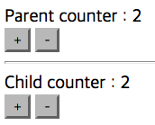

이유는 Parent 의 counter 를 Child 에서 props 로 넘겨 받았기 때문이다.

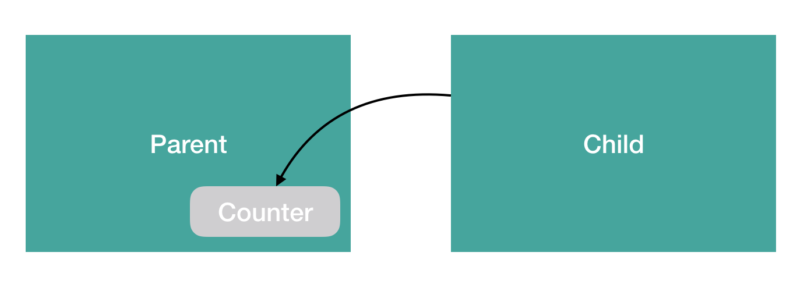

달리 말해, **동일한 데이터 속성을 단지 2 개의 컴포넌트에서 동시에 접근하여 같은 값을 표현하고 있는 것이다.**

위 구조는 Vue 의 props 를 이용한 기본적인 Parent - Child 컴포넌트 통신이다. 화면의 단위를 잘게 쪼개면 쪼갤수록 한 컴포넌트의 데이터를 다른 컴포넌트의 화면에서 표시할 일이 많아진다. 여기서 컴포넌트의 갯수가 무한정 많아진다면? 천재가 아닌 이상 이걸 다 기억할 수도 없고, 가장 중요한 것은 협업하는 입장에서는 소스를 일일이 다 까봐야 추적이 가능하다.

**이런 비효율적인 컴포넌트 간 통신 관리를 Vuex 로 해결해보자.**

### 11.3.3 Vuex 설치 및 등록
아래 명령어로 VueX 를 설치하자.
```
npm install vuex --save
```
그리고 Vuex 를 등록할 js 파일을 하나 새로 생성한다. 이름은 관례에 따라 store.js 로 지정한다.
```
// store.js
import Vue from 'vue'
import Vuex from 'vuex'

Vue.use(Vuex);

export const store = new Vuex.Store({
  //
});
```
그리고 Vue App이 등록된 main.js로 넘어가서 store.js를 불러와 등록하면 된다.
```
// main.js
import Vue from 'vue'
import App from './App.vue'
// store.js 를 불러와
import { store } from './store'

new Vue({
  el: '#app',
  // Vue 인스턴스에 등록한다.
  store,
  render: h => h(App)
})
```
### 11.3.4 state(상태) 등록
state 를 Vuex 에 아래와 같이 추가할 수 있다.
```
// store.js
import Vue from 'vue'
import Vuex from 'vuex'

Vue.use(Vuex);

export const store = new Vuex.Store({
  // counter 라는 state 속성을 추가
  state: {
    counter: 0
  },
});
```
state 에 정의된 counter 속성은 Parent 컴포넌트 에서 사용하던 data 속성 counter 와 동일한 역할을 한다. 이미 앞 상태관리 패턴 챕터 에서 설명했듯이 **“state 는 컴포넌트 간에 공유할 data 속성을 의미한다.”**

### 11.3.5 state 접근
방금 state 에 등록한 counter 를 앱에서 접근하려면 this.$store.state.counter 를 활용한다. 앞의 App.vue 를 Vuex 에 맞게 다시 정리하면
```
<div id="app">
  Parent counter : {{ this.$store.state.counter }} <br>
  <button @click="addCounter">+</button>
  <button @click="subCounter">-</button>

  <!-- 기존 코드 -->
  <!-- <child v-bind:passedCounter="counter"></child> -->
  <child></child>
</div>
```
```
// App.vue
import Child from './Child.vue'

export default {
  // 기존 코드
  // data () {
  //   return {
  //     counter: 0
  //   }
  // },
  methods: {
    addCounter() {
      this.$store.state.counter++;
    },
    subCounter() {
      this.$store.state.counter--;
    }
  },
  components: {
    'child': Child
  }
}
```
기존 코드와의 차이점은

1. data 속성으로 선언한 counter 값 제거
2. Child 컴포넌트로 counter 를 전달하지 않음

결국 Parent 에서 관리하던 counter 라는 데이터를 Vuex 에 state 로 넘겨준 것이다. Child 컴포넌트에서 접근하던 Parent 컴포넌트의 data 가 Vuex 로 갔기 때문에, 이제 Child 와 Parent 모두 Vuex 의 state 를 바라본다. **따라서, Vuex 라는 저장소의 데이터를 모든 컴포넌트들이 동일한 조건에서 접근하여 사용하게 된다.**

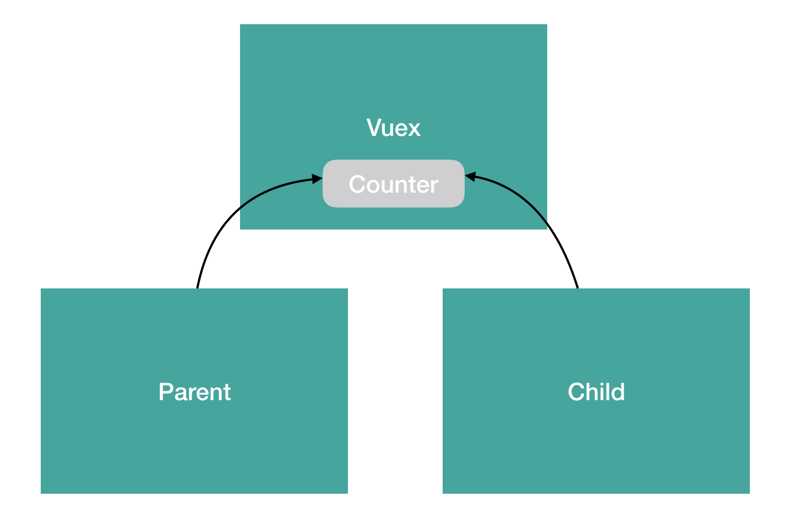

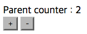

**화면상으로는 이전과 차이가 없지만 내부적으로는 Vuex 로 데이터 관리를 하고 있는 큰 차이가 있다.**

동일하게 Child 컴포넌트의 코드에도 Vuex 를 반영해보면
```
<!-- Child (Child.vue) Template -->
<div>
  <hr>
  Child counter : {{ this.$store.state.counter }} <br>
  <button>+</button>
  <button>-</button>
</div>
```
```
export default {
  // 기존 코드
  // props: ['passedCounter']
}
```
Parent 컴포넌트 에서 props 로 counter 를 전달받던 방식에서, Vuex 의 state 인 counter 로 바로 접근하는 방식으로 변경됐다.

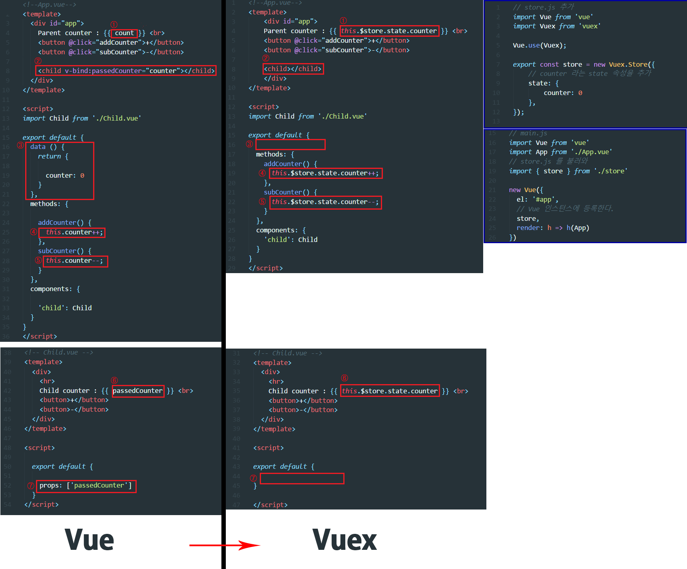

## 11.4 Getters(게터)
중앙 데이터 관리식 구조에서 발생하는 문제점은 **각 컴포넌트에서 Vuex의 데이터를 접근할 때 중복된 코드를 반복호출하게 되는 것**이다.

코드를 통해 예를 들어보자.
```
// App.vue
computed: {
  doubleCounter() {
    return this.$store.state.counter * 2;
  }
},

// Child.vue
computed: {
  doubleCounter() {
    return this.$store.state.counter * 2;
  }
},
```
여러 컴포넌트에서 같은 로직을 비효율적으로 중복 사용 하고 있다.
이때, Vuex의 **데이터 변경**을 각 컴포넌트에서 수행하는게 아니라, **Vuex에서 수행**하도록 하고 **각 컴포넌트에서 수행 로직을 호출**하면 코드 가독성이 올라가고 성능에서도 이점이 생긴다.

아래 코드 처럼 말이다.
```
// store.js (Vuex)
getters: {
  doubleCounter: function (state) {
    return state.counter * 2;
  }
},

// App.vue
computed: {
  doubleCounter() {
    return this.$store.getters.doubleCounter;
  }
},

// Child.vue
computed: {
  doubleCounter() {
    return this.$store.getters.doubleCounter;
  }
},
```
Getters 를 적용해도 비슷해 보이는가? 이건 정말 간단한 예제일 뿐이다. 만약
```
this.store.state.todos.filter(todo => todo.done)...
```
등의 복잡한 로직이라면 왜 Getters 를 쓰는게 편할지 납득이 갈 것이다.
### 11.4.1 Getters 등록을 위한 코드 정리
11.3 에서 사용했던 코드에 getters를 추가해보자.

정리해야 하는 부분은 아래와 같다.
```
<!-- App.vue -->
<div id="app">
  Parent counter : {{ this.$store.state.counter }}
  <!-- ... -->
</div>
```
Vue 공식 사이트에서 언급된 것처럼 Template 의 표현식은 최대한 간소화해야 한다.

따라서,
```
<!-- App.vue -->
<div id="app">
  Parent counter : {{ parentCounter }}
  <!-- ... -->
</div>

<!-- Child.vue -->
<div>
  Child counter : {{ childCounter }}
  <!-- ... -->
</div>
```
```
// App.vue
computed: {
  parentCounter() {
    return this.$store.state.counter;
  }
},

// Child.vue
computed: {
  childCounter() {
    return this.$store.state.counter;
  }
},
```
computed 속성을 활용함으로써 Template 코드가 더 간결해지고, 가독성이 좋아졌다.

### 11.4.2 Getters 등록
 getters 를 Vuex 에 추가한다.
 ```
 // store.js
export const store = new Vuex.Store({
  // ...
  getters: {
    getCounter: function (state) {
      return state.counter;
    }
  }
});
 ```
 ### 11.4.3 Getters 사용
등록된 getters 를 각 컴포넌트에서 사용하려면 this.$store 를 이용하여 getters 에 접근한다.

```
// App.vue
computed: {
  parentCounter() {
    this.$store.getters.getCounter;
  }
},

// Child.vue
computed: {
  childCounter() {
    this.$store.getters.getCounter;
  }
},
```
이렇게 getters 를 Vuex 에 등록하고 사용하였다. 참고로, computed 의 장점인 Caching 효과는 단순히 state 값을 반환하는 것이 아니라, getters 에 선언된 속성에서 filter(), reverse() 등의 추가적인 계산 로직이 들어갈 때 발휘된다.
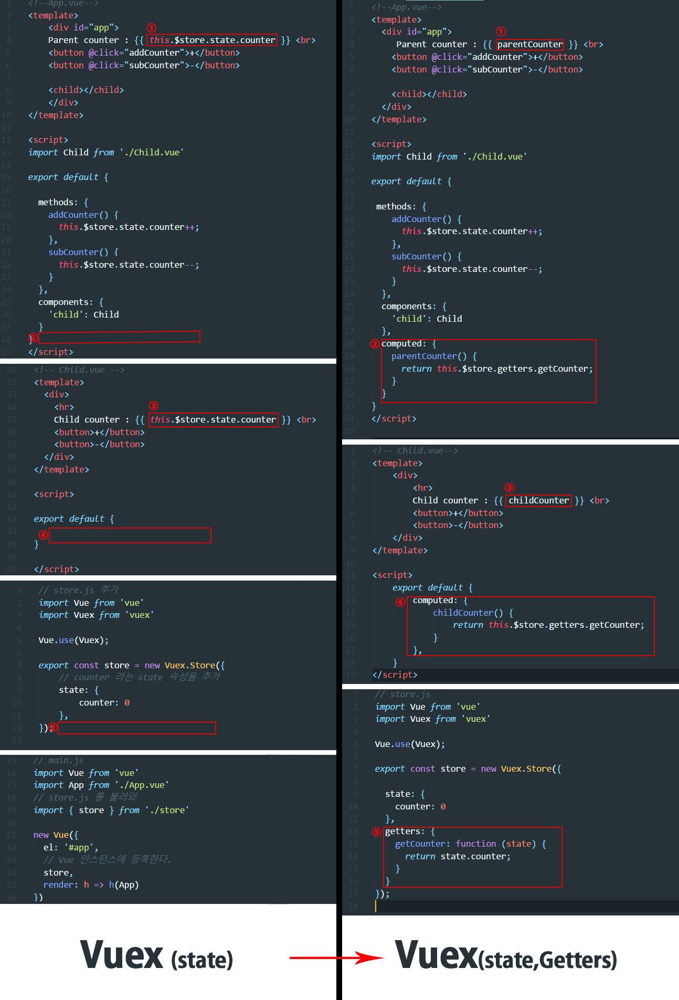

### 11.4.4 mapGetters
Vuex 에 내장된 helper 함수, mapGetters 로 이미 위에서 한번 가독성이 올라간 코드를 더 직관적이게 작성할 수 있다.
```
<!-- App.vue -->
<div id="app">
  Parent counter : {{ parentCounter }}
  <!-- ... -->
</div>
```
```
// App.vue
import { mapGetters } from 'vuex'

// ...
computed: mapGetters({
  parentCounter : 'getCounter' // getCounter 는 Vuex 의 getters 에 선언된 속성 이름
}),
```
또는 Vuex 의 getters 속성 이름과 컴포넌트의 computed 속성을 동일하게 하여 아래와 같이 간단하게 선언할 수도 있다.
```
<!-- App.vue -->
<div id="app">
  Parent counter : {{ getCounter }}
  <!-- ... -->
</div>
```
```
// App.vue
import { mapGetters } from 'vuex'

computed: mapGetters([
  'getCounter'
]),
```
여기서 **주의할 점은 위 방법들은 컴포넌트 자체에서 사용할 computed 속성과 함께 사용할 수 없다**는 점이다. 해결방안은 ES6 의 문법 ...(확장 연산자) 을 사용하면 된다.
```
// App.vue
import { mapGetters } from 'vuex'

computed: {
  ...mapGetters([
    'getCounter'
  ]),
  anotherCounter() {
    // ...
  }
}
```
다만 ... 문법을 사용하려면 Babel stage-2 라이브러리 설치 및 babel preset 에 추가가 필요하다. 상세한 설명은 [여기를](https://goo.gl/gHEaQ1) 참고한다.
## 11.5 Mutation(변이) 란?
Mutations 이란 Vuex 의 데이터, 즉 state 값을 변경하는 로직들을 의미한다. Getters 와 차이점은

1. 인자를 받아 Vuex 에 넘겨줄 수 있고
2. computed 가 아닌 methods 에 등록

**Mutations 의 성격상 안에 정의한 로직들이 순차적으로 일어나야 각 컴포넌트의 반영 여부를 제대로 추적할 수가 있기 때문이다.**

여태까지 우리는 counter 를 변경할 떄
```
return this.$store.state.counter++;
return this.$store.state.counter;
```
와 같이 컴포넌트에서 직접 state 에 접근하여 변경하였지만, 이는 안티패턴으로써 Vue 의 Reactivity 체계와 상태관리 패턴에 맞지 않은 구현방식이다. 안티패턴인 이유는 여러 개의 컴포넌트에서 같은 state 값을 동시에 제어하게 되면, state 값이 어느 컴포넌트에서 호출해서 변경된건지 추적하기가 어렵기 때문이다. 하지만, 상태 변화를 명시적으로 수행함으로써 테스팅, 디버깅, Vue 의 Reactive 성질 준수 의 혜택을 얻는다.

Mutations 가 낯설다면 기억하기 쉽게 Setters 로 이해하자.

### 11.5.1 Mutations 등록
getters 와 마찬가지로 Vuex 에 mutations 속성을 추가한다.
```
// store.js
export const store = new Vuex.Store({
  // ...
  mutations: {
    addCounter: function (state, payload) {
      return state.counter++;
    }
  }
});
```

### 11.5.2 Mutations 사용
App.vue 의 기존 코드는 addCounter 에서 state 의 counter 값을 바로 접근하여 1 을 올리는 코드였다.
```
<!-- App.vue -->
<div id="app">
  Parent counter : {{ parentCounter }} <br>
  <button @click="addCounter">+</button>
  <!-- ... -->
</div>
```
```
// App.vue
methods: {
  addCounter() {
    this.$store.state.counter++;
  }
},
```
state 를 컴포넌트에서 직접 접근하여 증가시키는 부분을 앞에서 등록했던 mutations 를 이용하는 코드로 바꾸면 아래와 같다.
```
// App.vue
methods: {
  addCounter() {
    // this.$store.state.counter++;
    this.$store.commit('addCounter');
  }
},
```
여기서 주목할만한 부분은 getters 처럼
```
this.$store.mutations.addCounter;
```
이런 식의 접근이 불가능하고, commit 을 이용하여 mutations 이벤트를 호출해야 한다는 점이다. 앞서 설명한 추적 가능한 상태 변화를 위해 프레임워크가 이렇게 구조화가 되어 있다는 것을 알고 넘어가자.
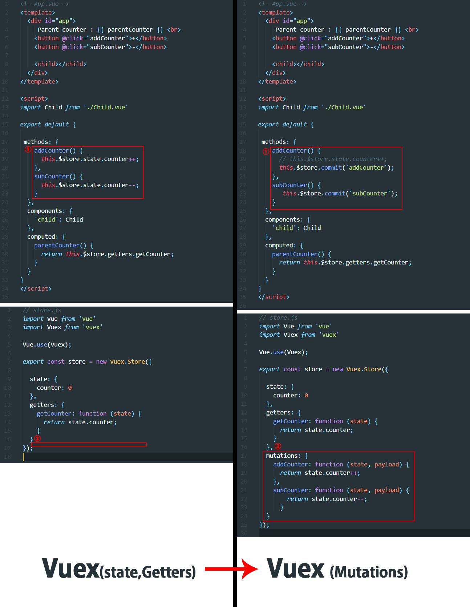

### 11.5.3 Mutations 에 인자 값 넘기기
각 컴포넌트에서 Vuex 의 state 를 조작하는데 필요한 특정 값들을 넘기고 싶을 때는 commit() 에 두 번째 인자를 추가한다.
```
this.$store.commit('addCounter', 10);
this.$store.commit('addCounter', {
  value: 10,
  arr: ["a", "b", "c"]
});
```
이를 Vuex 에서 아래와 같이 받을 수 있다.
```
mutations: {
  // payload 가 { value : 10 } 일 경우
  addCounter: function (state, payload) {
    state.counter = payload.value;
  }
}
```
데이터 인자명은 보통 payload 를 많이 쓴다.
### 11.5.4 mapMutations 
mapGetters 와 마찬가지로, Vuex 에 내장된 mapMutations 를 이용하여 코드 가독성을 높일 수 있다.
```
// App.vue
import { mapMutations } from 'vuex'

methods: {
  // Vuex 의 Mutations 메서드 명과 App.vue 메서드 명이 동일할 때 [] 사용
  ...mapMutations([
    'addCounter'
  ]),
  // Vuex 의 Mutations 메서드 명과 App.vue 메서드 명을 다르게 매칭할 때 {} 사용
  ...mapMutations({
    addCounter: 'addCounter' // 앞 addCounter 는 해당 컴포넌트의 메서드를, 뒤 addCounter 는 Vuex 의 Mutations 를 의미
  })
}
```
## 11.6 Actions (액션)
Mutations 에는 순차적인 로직들만 선언하고 Actions 에는 비 순차적 또는 비동기 처리 로직들을 선언한다. 그렇다면 왜 처리 로직의 성격에 따라 Mutations 과 Actions 로 나눠 등록해야 할까?

Mutations 에 대해 잠깐 짚어보면, Mutations 의 역할 자체가 State 관리에 주안점을 두고 있다. 상태관리 자체가 한 데이터에 대해 여러 개의 컴포넌트가 관여하는 것을 효율적으로 관리하기 위함인데 Mutations 에 비동기 처리 로직들이 포함되면 같은 값에 대해 여러 개의 컴포넌트에서 변경을 요청했을 때, 그 변경 순서 파악이 어렵기 때문이다.

```
이러한 문제를 방지하기 위해 비동기 처리 로직은 Actions 에 동기 처리 로직은 Mutations 에 나눠 구현한다.
```
따라서, setTimeout() 이나 서버와의 http 통신 처리 같이 결과를 받아올 타이밍이 예측되지 않은 로직은 Actions 에 선언한다.

### 11.6.1 Actions 등록
Vuex 에 Actions 를 등록하는 방법은 다른 속성과 유사하다. actions 를 선언하고 action method 를 추가해준다.
```
// store.js
export const store = new Vuex.Store({
  // ...
  mutations: {
    addCounter: function (state, payload) {
      return state.counter++;
    }
  },
  actions: {
    addCounter: function (context) {
      // commit 의 대상인 addCounter 는 mutations 의 메서드를 의미한다.
      return context.commit('addCounter');
    }
  }
});
```
상태가 변화하는 걸 추적하기 위해 actions 는 결국 mutations 의 메서드를 호출(commit) 하는 구조가 된다.
```
// store.js
export const store = new Vuex.Store({
  actions: {
    getServerData: function (context) {
      return axios.get("sample.json").then(function() {
        // ...
      });
    },
    delayFewMinutes: function (context) {
      return setTimeout(function () {
        commit('addCounter');
      }, 1000);
    }
  }
});
```
위처럼 HTTP get 요청이나 setTimeout 과 같은 비동기 처리 로직들은 actions 에 선언해준다.

### 11.6.2 Actions 사용
앞에서는 mutations 를 이용하여 counter 를 하나씩 늘렸다. 이번엔 actions 를 이용해보자. actions 를 호출할 때는 아래와 같이 **dispatch()** 를 이용한다.
```
// App.vue
methods: {
  // Mutations 를 이용할 때
  addCounter() {
    this.$store.commit('addCounter');
  }
  // Actions 를 이용할 때
  addCounter() {
    this.$store.dispatch('addCounter');
  }
},
```
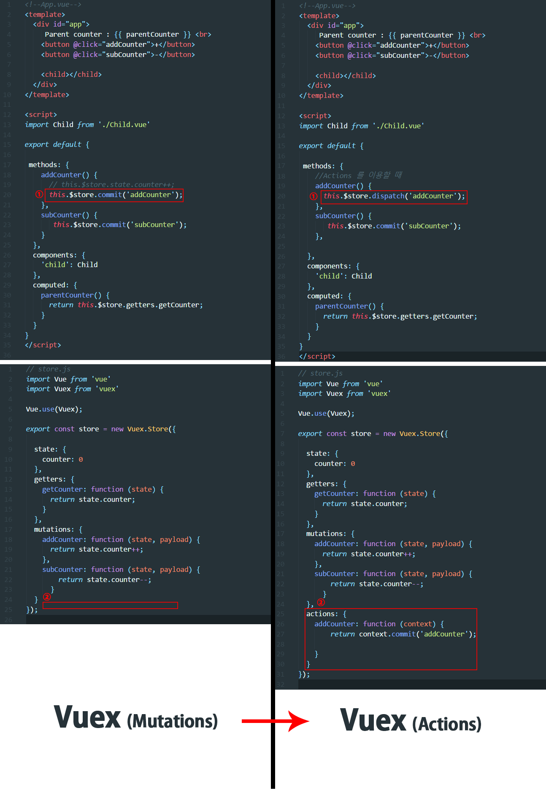

### 11.6.3 Actions 에 인자 값 넘기기
Actions 에 인자를 넘기는 방법은 Mutations 와 유사하다.
```
<!-- by 와 duration 등의 여러 인자 값을 넘길 경우, 객체안에 key - value 형태로 여러 값을 넘길 수 있다 -->
<button @click="asyncIncrement({ by: 50, duration: 500 })">Increment</button>
```
```
export const store = new Vuex.Store({
  actions: {
    // payload 는 일반적으로 사용하는 인자 명
    asyncIncrement: function (context, payload) {
      return setTimeout(function () {
        context.commit('increment', payload.by);
      }, payload.duration);
    }
  }
})
```

### 11.6.4 mapActions 
mapGetters, mapMutations 헬퍼 함수들과 마찬가지로 mapActions 도 동일한 방식으로 사용할 수 있다.
```
import {mapActions} from 'vuex';

export default {
  methods: {
    ...mapActions([
      'asyncIncrement',
      'asyncDecrement'
    ])
  },
}
```

### 폴더 구조화 & Namespacing
중간 크기 이상의 복잡한 앱을 제작할 때 getters & mutations & actions 의 이름을 유일하게 정하지 않으면 namespace 충돌이 난다. **따라서, 네임스페이스를 구분하기 위해 types.js 로 각 속성의 이름들을 빼고 store.js 와 각 컴포넌트에 import 하여 사용하는 방법이 있다.** 혹은 modules 라는 폴더로 만들어 각 단위별로 파일을 쪼개서 관리하는 방법도 있다.

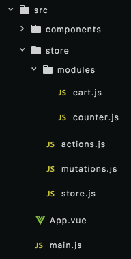

생각보다 복잡하므로 앱이 커서 중형 이상의 앱에서만 사용하는게 좋을 듯하다. 간단한 화면 개발에는 오히려 배보다 배꼽이 클 수 있다.

## 11.7 대규모 애플리케이션에서의 Vuex 사용
## 11.8 연락처 애플리케이션에 Vuex 적용하기

